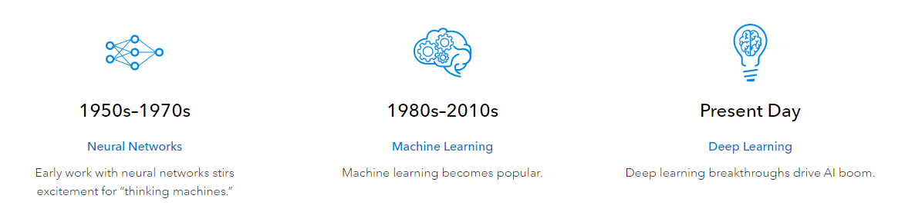

### [1. Click here to read entire article](https://www.sas.com/en_us/insights/analytics/what-is-artificial-intelligence.html#:~:text=Artificial%20Intelligence%20enhances%20the%20speed,manually%20intense%20data%20management%20tasks.)

## Trend in AI 

## Why AI is important?
- AI automates repetitive learning and discovery through data.
- AI adds intelligence
- AI adapts through progressive learning algorithms
- AI achieves incredible accuracy
- AI analyzes more and deeper data
- AI gets the most out of data.

## Applications of AI
1. Health Care
- AI applications can provide personalized medicine and X-ray readings. Personal health care assistants can act as life coaches, reminding you to take your pills, exercise or eat healthier.
2. Retail
- AI provides virtual shopping capabilities that offer personalized recommendations and discuss purchase options with the consumer. Stock management and site layout technologies will also be improved with AI.
3. Banking 
- Artificial Intelligence enhances the speed, precision and effectiveness of human efforts. In financial institutions, AI techniques can be used to identify which transactions are likely to be fraudulent, adopt fast and accurate credit scoring, as well as automate manually intense data management tasks.

### [2. Click here to read entire article](https://theconversation.com/five-ways-artificial-intelligence-can-help-space-exploration-153664)

Advances in AI have allowed us to make progress in all kinds of disciplines – and these are not limited to applications on this planet. From designing missions to clearing Earth’s orbit of junk, here are a few ways artificial intelligence can help us venture further in space.

## How it is useful in Space Exploration
1. ### Astronaut assistants
 - A recently developed virtual assistant can potentially detect any dangers in lengthy space missions such as changes in the spacecraft atmosphere – for example increased carbon dioxide – or a sensor malfunction that could be potentially harmful. It would then alert the crew with suggestions for inspection.
2. ### Mission design and Planning
 - Researchers are working on the idea of a design engineering assistant to reduce the time required for initial mission design which otherwise takes many human work hours. “Daphne” is another example of an intelligent assistant for designing Earth observation satellite systems. Daphne is used by systems engineers in satellite design teams. It makes their job easier by providing access to relevant information including feedback as well as answers to specific queries.
3. ### Satellite data processing
- AI for data processing can also be used for the satellites themselves. In recent research, scientists tested various AI techniques for a remote satellite health monitoring system. This is capable of analysing data received from satellites to detect any problems, predict satellite health performance and present a visualisation for informed decision making.
4. ### Space Debris
-  There are some innovative approaches to deal with the menace, such as designing satellites to re-enter Earth’s atmosphere if they are deployed within the low Earth orbit region making them disintegrate completely in a controlled way. Another approach is to avoid any possible collisions in space, preventing the creation of any debris. In a recent study, researchers developed a method to design collision avoidance manoeuvres using machine-learning (ML) techniques.
5. Navigation Sytems
- We do not have any navigation satellites around the Moon or Mars but we could use the millions of images we have from observation satellites such as the Lunar Reconnaissance Orbiter (LRO). In 2018, a team of researchers from NASA in collaboration with Intel developed an intelligent navigation system using AI to explore the planets. They trained the model on the millions of photographs available from various missions and created a virtual Moon map.

## Conclusion
AI and machine learning capabilities are making significant impacts in the space industry by creating efficiencies in mission planning and operations and providing scientists with the ability to explore the far reaches of space. While automation of tasks paves the way for the use of AI, the ability for spacecraft to become fully cognitive machines, capable of making critical decisions based on their current environment, without reliance on ground systems to perform essential functions will create more time for humans to spend on valued and more complex research activities.

## Other References
1. ASA – Mars Perseverance Press Kit: https://www.jpl.nasa.gov/news/press_kits/mars_2020/download/mars_2020_landing_press_kit.pdf
2. Investopedia – Artificial Intelligence (AI): https://www.investopedia.com/terms/a/artificial-intelligence-ai.asp
3. Wikipedia – Artificial Intelligence: https://en.wikipedia.org/wiki/Artificial_intelligence
4. 10XDS – Top 10 Benefits of Artificial Intelligence (AI): https://www.10xds.com/blog/benefits-of-artificial-intelligence-ai/
5. Medium.com – Artificial Intelligence for Space Exploration: https://medium.com/@apltownsend/artificial-intelligence-for-space-exploration-703d2838e37c
6. ESA – AIKO: Autonomous Satellite Operations Thanks to Artificial Intelligence https://www.esa.int/Applications/Telecommunications_Integrated_Applications/Technology_Transfer/AIKO_Autonomous_satellite_operations_thanks_to_Artificial_Intelligence
7. Goddard Space Flight Center – NExIS OSAM-1: https://nexis.gsfc.nasa.gov/osam-1.html